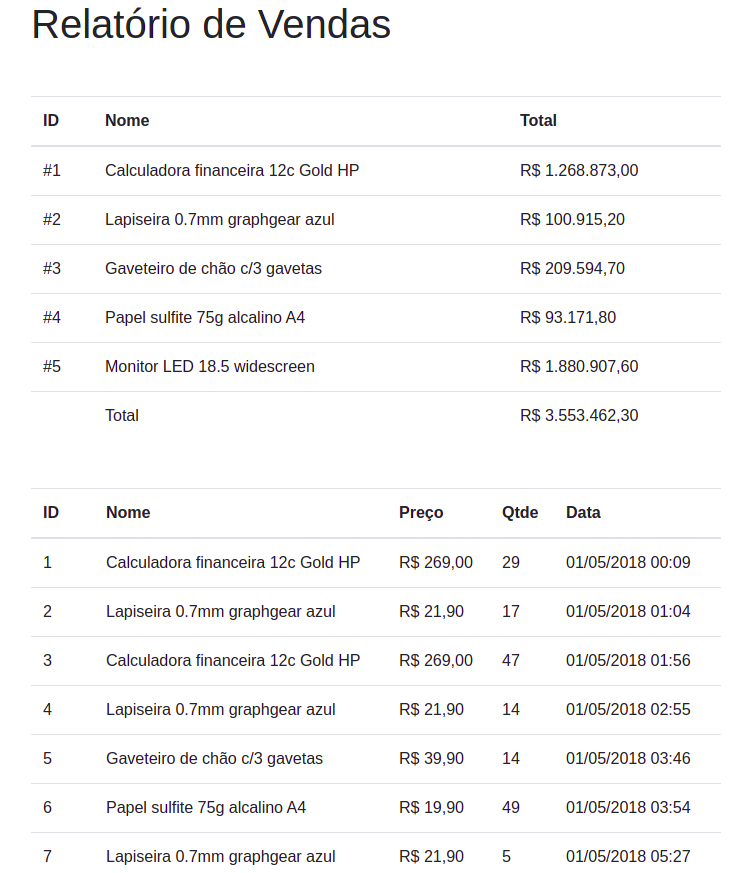

# VueJS-Studies
Studies and Basic Projects using VueJS

### QRCode Project
It will generate a qrcode depending on the text input.

### Sales Project
Using a data from a json file, this system will generate two tables. The first one is a list of products, prices, amounts and dates of registration. The second one about the total amount from the first table.

### Project

You can run the project using  `npm run nameOfProject`