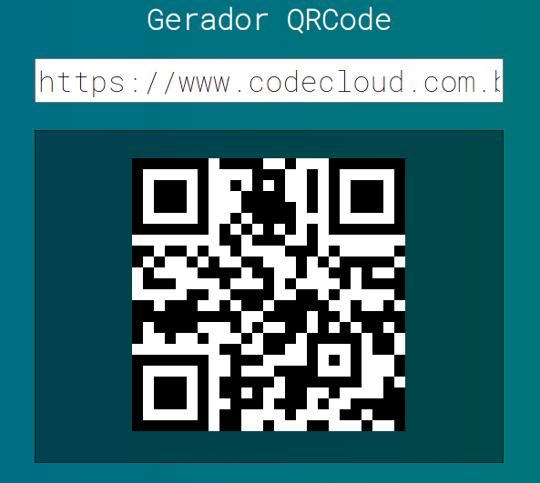

# VueJS-Studies

Welcome to my Vue.js Basic Studies repository, where I explore basics aspects of Vue.js and build basic projects to strengthen my skills.

### QRCode Project
The QRCode Project is a simple utility that generates a QR code based on the text input you provide. It's a practical example of how Vue.js can be used to create interactive and dynamic applications.

### Project

You can run the project using  `npm run nameOfProject`
